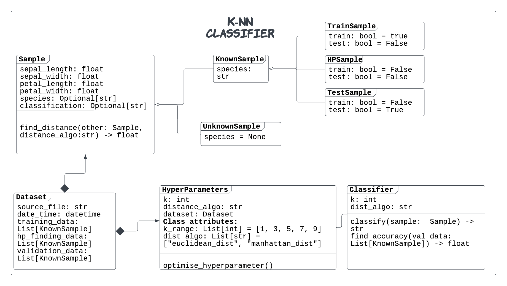

# k-NN-classifier
Building a k-NN classifier engine for learning purpose

Reference:
**This project is completely based on the guidance provided in the book "Python Object-Oriented Programming Fourth Edition by Steven F.Lott and Dusty Phillips". 
This project is created purely for learning purpose.**
This project is ideal for leaning purposes because the Iris Classification dataset is a simple well prepared dataset that we can enjoy good accuracies in the classification while giving more
importance to learning best practice in software development. This project includes the following:

1. Unit and regression tests
2. Design patterns like strategy design pattern for choosing difference distance algorithms
3. Python's concurrent.futures for running computations in multiple cores to achieve massive speed boosts during the grid search for parameters
4. CICD using GitHub Actions


The above diagram shows the UML diagram of the project.

### Tool Usage
Project Setup

Setup the required env variables
```commandline
export CLASSIFIER_HOME_DIR=</../../k-NN-classifier>
```

Run the classifier
```python
python knn_classifier.py --raw_inp_data_path <path_to_dataset>
```
